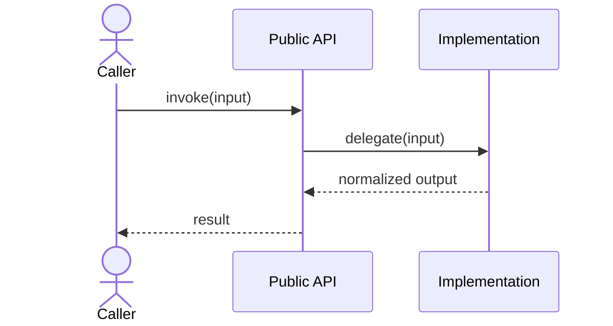

# Chapter Template

Use the sections that clarify the subject; omit sections that would be decorative or repetitive.

````md
# <Number>. <Chinese Topic> / <Primary English Terms>

## This Chapter Answers
- <The concrete questions this chapter resolves>

## Module Boundary
- <What belongs here>
- <What explicitly belongs elsewhere>

## Core Terms
| English term | Chinese meaning | Role in this module |
| --- | --- | --- |

## Architecture


## Runtime Flow
1. <Input and entry point>
2. <Key orchestration>
3. <State, output, or error result>

## Key Sequence


## Source Walkthrough
### `<ImportantClass>`
- Caller and purpose:
- Input / state / config:
- Output and state update:
- Why this boundary exists:

## Corrections and Version Notes
| Note claim | Current source | Explanation |
| --- | --- | --- |

## Common Misconceptions
- <Confusion and correction>

## Mental Model
<A concise coherent understanding of the system.>
````

For `explain`-only requests, do not blindly reproduce the entire template. Start with the user's material, then add only the missing sections that resolve the question.
